# Maskbook-VI

## Introduction

This specification ([Webpage](https://dimensiondev.github.io/Maskbook-VI/) \| [GitHub Repo](https://github.com/DimensionDev/Maskbook-VI)) is the manual for anyone who needs to work with the logos of Maskbook.

Many useful assets are provided within this repository. The use of these materials should follow this manual.

## 1. Managing Colors

### Fundamentals

The main color scheme of Maskbook is white (#FFFFFF) shape over blue (#1C68F3) canvas. This particular blue color is referred as "MBBlue" in this specification.

Unless particularly required by a certain situation, everyone is discouraged from using alternative colors. If you feel hard to remember, remember that the eyes are always blue.

It can be a good practice to use the white version when the background is black. But when the background is white, it is recommended to use the MBBlue version.

If the logo must be put on a predefined background and the background color is similar to MBBlue, a white ring is expected to be added around the circle logo externally. The width of the ring should be **5% of the width of the circle logo**. If using the squircle edition, the width of the external stroke should be **6% of the width of the squircle logo**.

### Examples

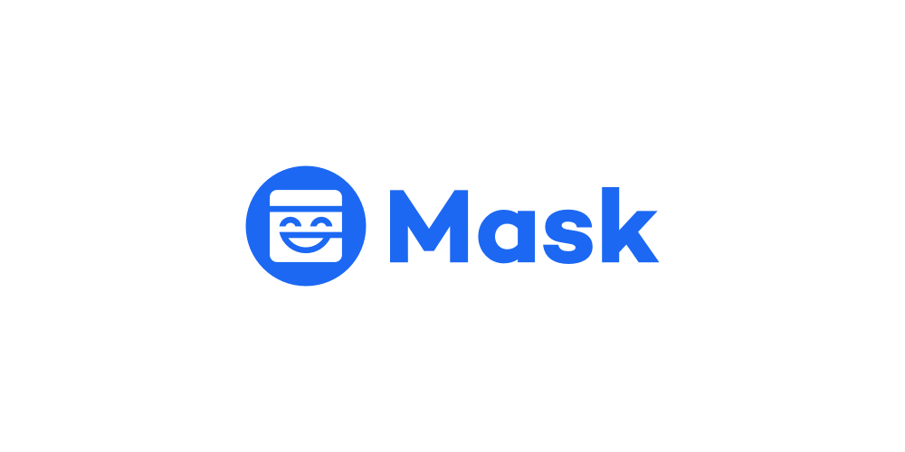

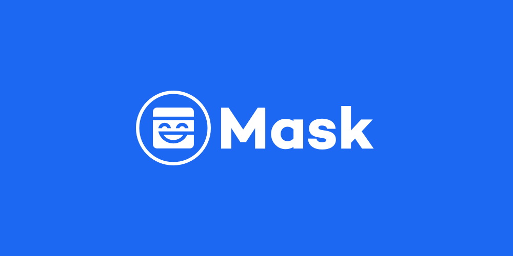

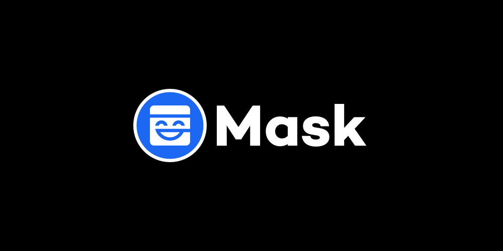

## 2. Geometric Logo

### Principles

The carved-from-a-squircle **core shape** shall never be used alone. A canvas must always accompany the core shape. The avatar display area (square, circle, or squircle) is considered a canvas.

When displaying a geometric logo of Maskbook, either going alone or going as part of a combination, on a free canvas, the circle edition should be preferred, the squircle edition is discouraged, and the square edition is prohibited.

### Square Canvas & Squircle Canvas

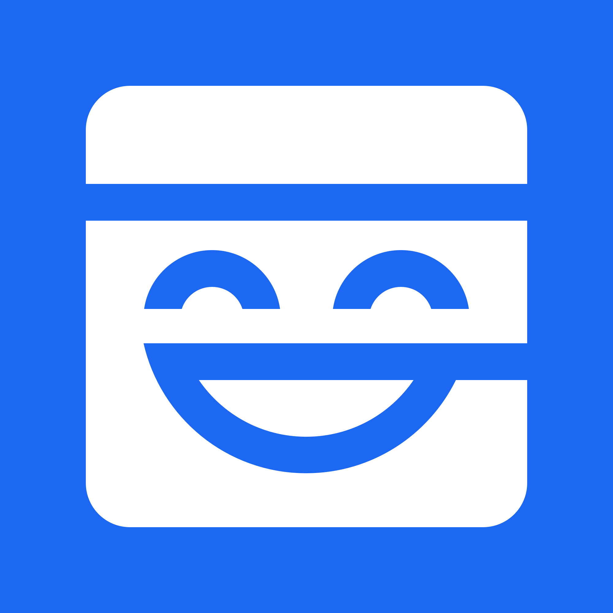
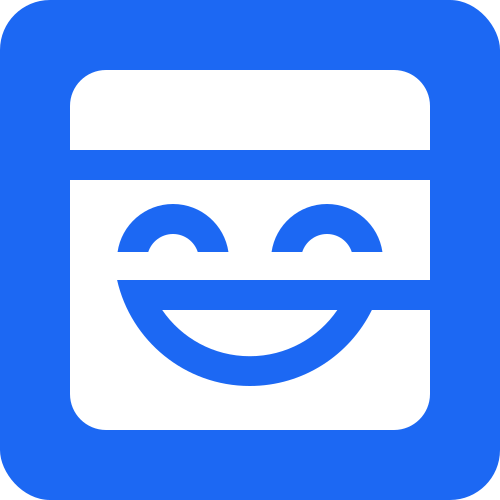

The width of the core shape should be **72% of the canvas width**.

When the environment has a specific border-radius preference for all squircle logos in the context (for example, a large post which displays a lot of apps by their icons), the border-radius should comply with the environment requirement. When there is no such requirement, the border-radius should be 10% of the width.

### Circle Canvas

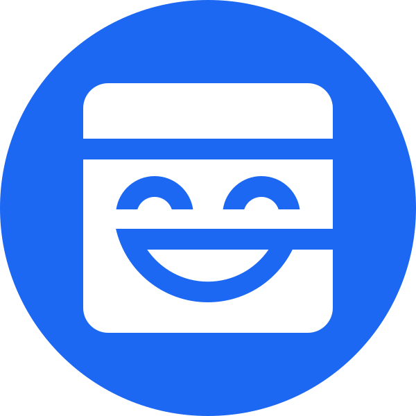

The width of the core shape should be **60% of the canvas width**.

## 3. Text Logo

The text logo of Maskbook is produced with the font [Campton by Rene Bieder](https://www.myfonts.com/fonts/rene-bieder/campton).

Font-weight is Bold. Letter-spacing is auto.

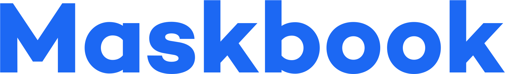

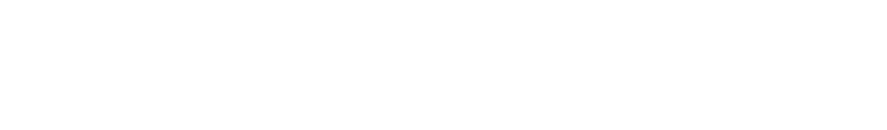

## 4. Geometric-Text Combinations

Combinations may be used for better brand identity recognition.

### Horizontal Combinations

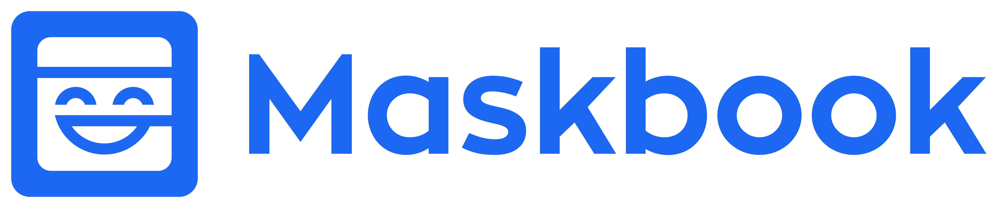

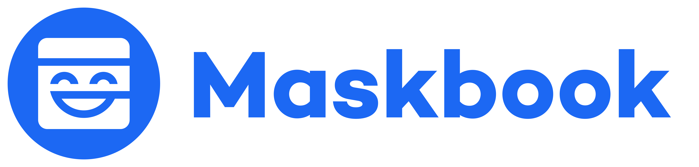

### Vertical Combinations

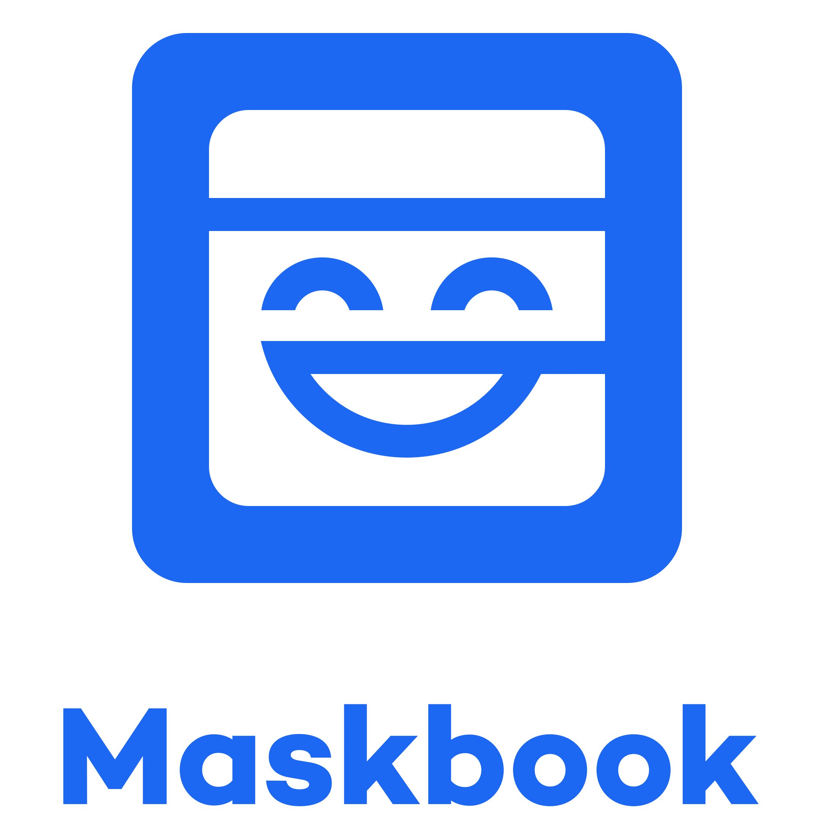

## 5. Meme Usage

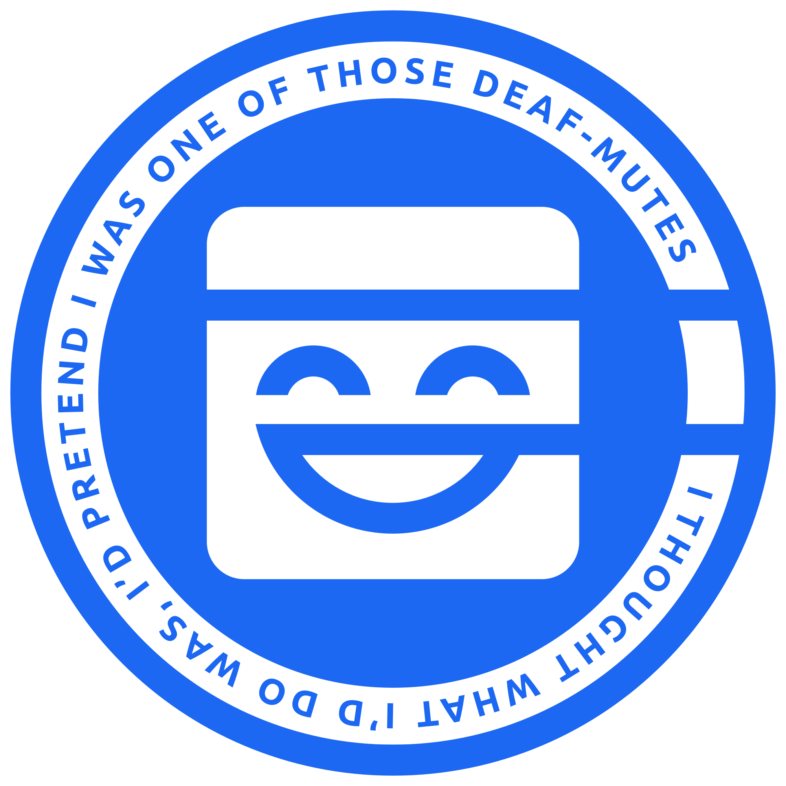
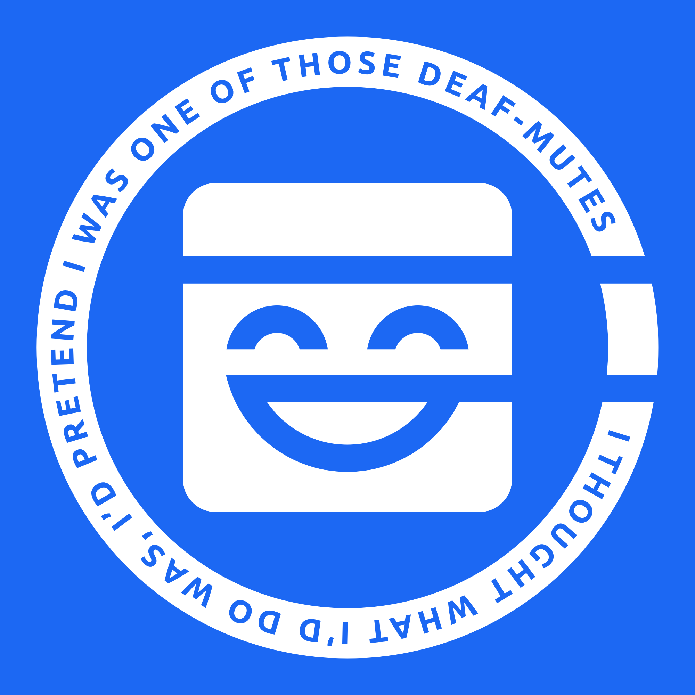

The variation with the text ring should be used mainly for meme purposes and community purposes (for example, non-official community chat group avatar).

## 6. Using As Avatars

If the avatar shape is **square or squircle**, use this image:

If the avatar shape is **circle**, use this image:

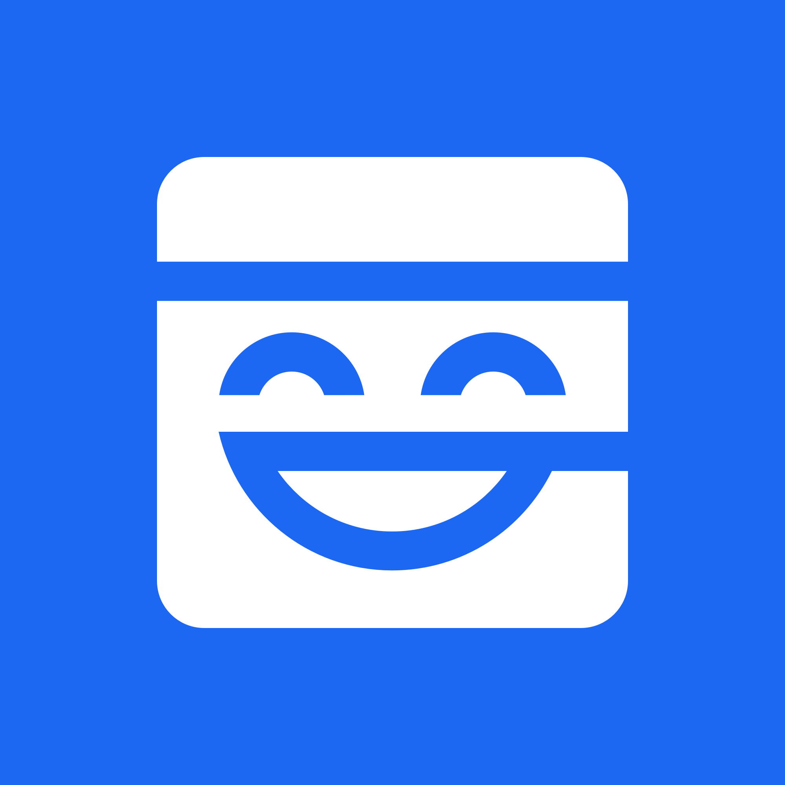

## Appendix 1: Copyright of Text

This specification, including "README.md" and "DOCUMENTATION.md" in this repository, is published with [GNU GFDL v1.3](https://www.gnu.org/licenses/fdl-1.3.html).

## Appendix 2: Copyright of Images

The images in this repository may be copyrighted by jurisdiction-specific entities of @DimensionDev across jurisdictions.

Any use of these images will not be considered a violation of the copyright of the images, as long as the use complies with the latest version of this specification. This specification may be updated without prior notification.

## Appendix 3: Trademark Policy

The word "Maskbook" and the shape "The Laughing Mask" are registered trademarks of several jurisdiction-specific entities of @DimensionDev across jurisdictions.

This specification grants any reader to use these trademarks on a royalty-free, temporary, and revokable basis. Any use must comply with the latest version of this specification, unless otherwise authorized with a dedicated written permission. This specification may be updated without prior notification. Appropriate trademark holding entities reserve the right to revoke the permission being granted hereby.

Any item, material or digital, must be free-of-charge for acquiring or using; attaching fares in alternative names (for example, shipping fees) are also prohibited.

Only the following purposes are hereby permitted by this specification:

- Community usages
    - IM-based chat group avatar
    - Meetup monumental items, only including:
        - Stickers
        - Posters
        - Postcards
        - Tees
        - Mugs
    - Meme pictures, over:
        - Personal blogs or personal newsletters
        - Personal social network accounts (posts and albums)
        - Personal forum accounts (e.g. Reddit & Imgur)
        - IM-based chat groups
        - Mailing lists
    - Personally maintained stickers for IM softwares (e.g. Telegram & WeChat)
    - Personal profile avatar component (a mask over a face)
